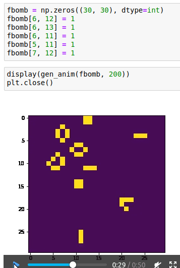
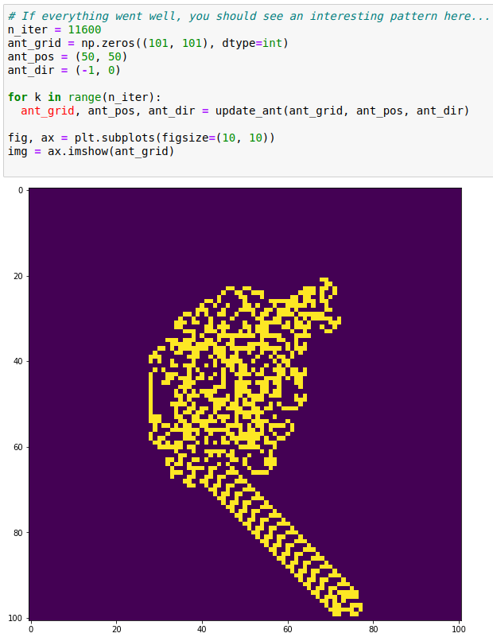

# Conway's Game of Life + The Langton's Ant

Two funny challenges my teacher [Jérémy Perret](https://github.com/jrmyp) gave us during our Wild Code School training.

Using Python's Numpy library, the goal was to show special patterns generated by simple math functions. The shapes kinda seem to live their own lives !

Learn more about Conway's Game of Life : in [english](https://www.youtube.com/watch?v=ouipbDkwHWA), or in [french](https://www.youtube.com/watch?v=S-W0NX97DB0).\
Learn more about Langton's Ant : in [english](https://www.youtube.com/watch?v=NWBToaXK5T0), or in [french](https://www.youtube.com/watch?v=qZRYGxF6D3w).

Have a peek :

**Conway's Game of Life, the bomb function :**\

**The Langton's Ant gone wild :**\

